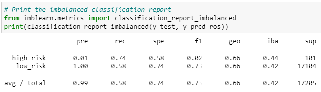
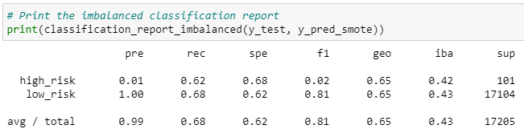
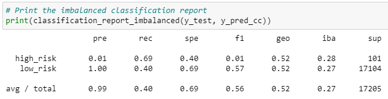
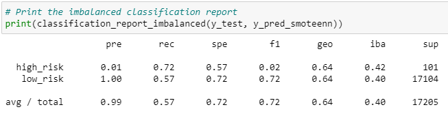
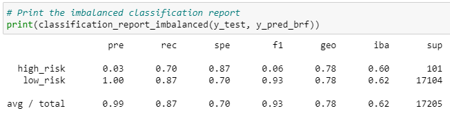

# Credit_Risk_Analysis

## Overview

Explain the purpose of this analysis.

## Results

Using bulleted lists, describe the balanced accuracy scores and the precision and recall scores of all six machine learning models. Use screenshots of your outputs to support your results.

- Naive Random Oversampling

- SMOTE Oversampling

- Cluster Centroid Undersampling

- SMOTEENN Combination Sampling

- Balanced Random Forest

- Easy Ensemble AdaBoost

## Summary

Summarize the results of the machine learning models, and include a recommendation on the model to use, if any. If you do not recommend any of the models, justify your reasoning.